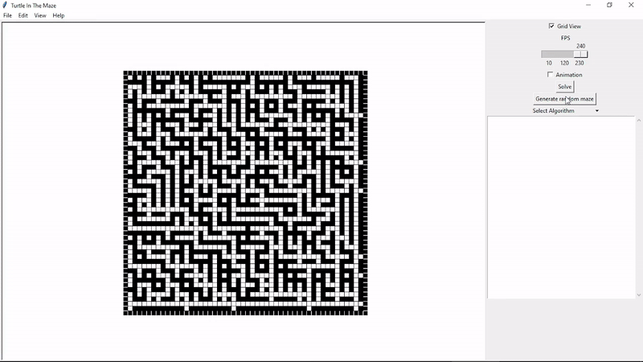
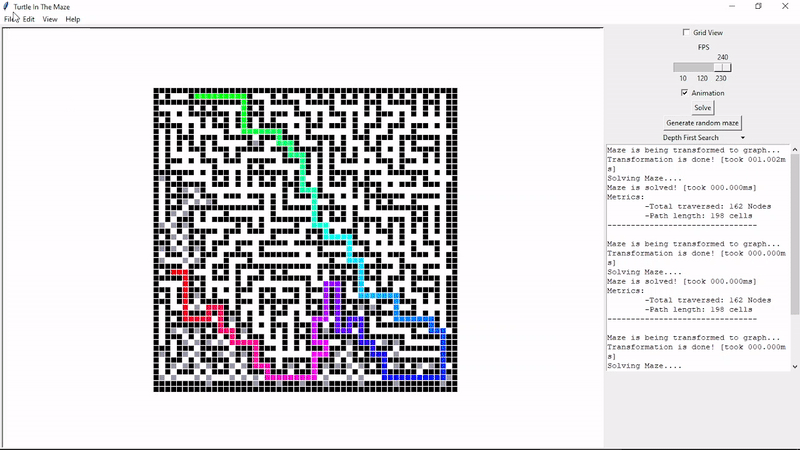
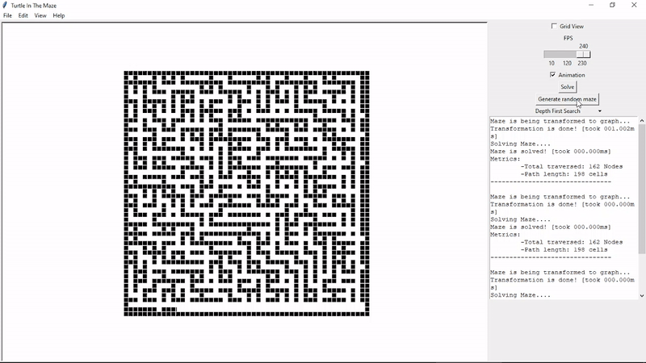
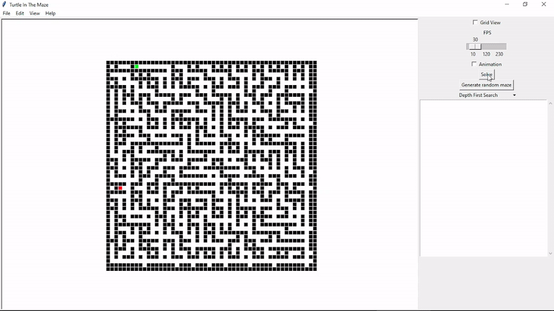
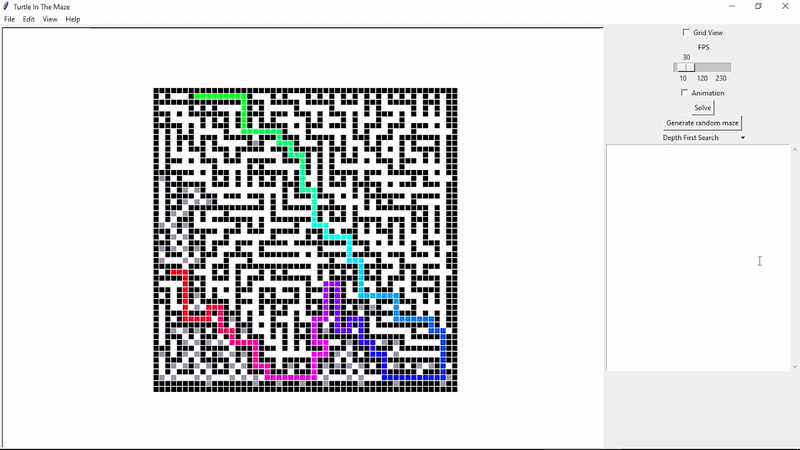

# TurtleInTheMaze
Python Maze-Solving Visualizer built on **MazeSolvingAlgos** module. You can see full demo [here](https://youtu.be/MWLFvymE8tM) and for quick one:

## Prerequisites
* **TKinter** and its submodule **turtle**:  
for GUI stuff. You can install it using pip (via `pip install tkinter`).

* **MazeSolvingAlgos** module:  
to be able to solve mazes. Get it from [here](https://github.com/MahmoudHussienMohamed/MazeSolvingAlgos).

* **PIL** module:  
to be able to save `DrawingCanvas` as **image** with **Ghostscript**. You can install it using pip (via `pip install pillow`).

* **Ghostscript**:  
to be able to deal with *tkinter canvas postscript* uing **PIL**. Download from [here](https://www.ghostscript.com).

## How to run
After satisfying prerequisites run `runner.py` and enter maze width and height, then feel free to draw with mouse or generate randome maze and solve it with any algorithm (***But** avoid Floyd-Warshall as you can especially for large mazes because it's $O(N^3)$ and may blows up your device ಠ‿ಠ* )

## How to use
Menubar:
* **File**:
    - **New**: to create new maze in the disk. **[Can be accessed via (*Ctrl*+*N*)]**
    - **Open**: to open existing maze from disk (*as TITMZ file*). **[Can be accessed via (*Ctrl*+*O*)]**
    - **Save**: to save the current maze in the disk (*as TITMZ file*). **[Can be accessed via (*Ctrl***+*S*)]
    - **Save as**: to save the current maze in image format (*PNG, JPG, JPEG or BMP*) or maze file (*TITMZ*). **[Can be accessed via (*Ctrl*+*Shift*+*N*)]**
    - **close**: to close the current working maze. **[Can be accessed via (*Ctrl*+*C*)]**
    - **Exit**: to exit the window.
 
*If you have curiosity to know why TITMZ (and I don't think you have); it's for `T`urtle`I`n`T`he`M`a`z`e.*

* **Edit**:
    - **Reset**: to erase solution from the maze if it's displayed, if not, it will erase the maze itself. **[Can be accessed via (*Ctrl*+*R*)]**
    
     
    - **Clear Event Box**: to erase **Event Box** content.
    - **invert**: to swap **orifice** cells with **block** ones. **[Can be accessed via (*Ctrl*+*I*)]** 
    
    

* **View**:
    - **Animation and Appearance**:
        - **Motion**: if checked solution will be visualized frame by frame according to **FPS slider**'s value; if not solution will be displayed at once. **[Can be accessed via (*Ctrl*+*M*)]**
        
        
        - **Grid View**: if checked gridlines will be displayed indicating cells' exact positions. **[Can be accessed via (*Ctrl*+*G*)]**
        
         
    
    - **Zooming**: 
      - **Zoom in** to magnify maze **[Can be accessed via (*Ctrl*+*=*)]**
      - and **Zoom out** for the opposite **[Can be accessed via (*Ctrl*+*-*)]**
    
     
- **Help**: under progress