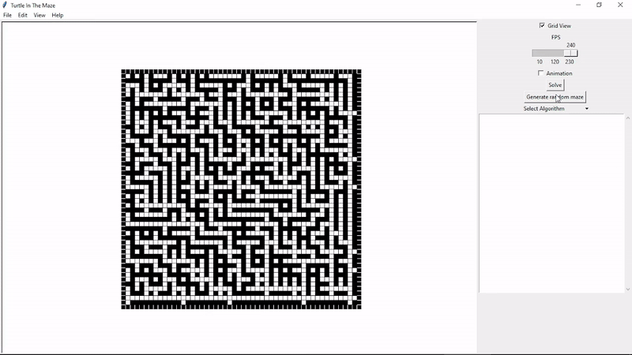

# TurtleInTheMaze
Python Maze-Solving Visualizer built on **MazeSolvingAlgos** module. You can see full demo [here](https://youtu.be/MWLFvymE8tM) and for quick one:

## Prerequisites
* **TKinter** and its submodule **turtle**:  
for GUI stuff. You can install it using pip (via `pip install tkinter`).

* **MazeSolvingAlgos** module:  
to be able to solve mazes. Get it from [here](https://github.com/MahmoudHussienMohamed/MazeSolvingAlgos).

* **PIL** module:  
to be able to save `DrawingCanvas` as **image** with **Ghostscript**. You can install it using pip (via `pip install pillow`).

* **Ghostscript**:  
to be able to deal with *tkinter canvas postscript* uing **PIL**. Download from [here](https://www.ghostscript.com).

## How to run and use
After satisfying prerequisites run `runner.py` and enter maze width and height, then feel free to draw with mouse or generate randome maze and solve it with any algorithm (***But** avoid Floyd-Warshall as you can especially for large mazes because it's $O(N^3)$ and may blows up your device ಠ‿ಠ* )
